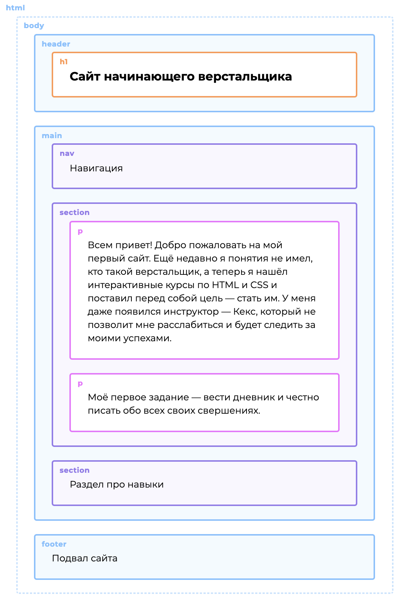

# Doctype в HTML, объявление типа документа



В [первой части](/chapters/1) из стартового тренажёра мы увидели как работает HTML и CSS, а заодно заслужили доверие инструктора Кекса. Поэтому босс поручил нам ответственное задание: спроектировать сайт начинающего верстальщика. Там вы будете вести свой дневник обучения, а Кекс следить за вашими успехами.

Ваша задача на эту часть — разработать прототипы главной и внутренней страниц сайта. Вы познакомитесь с устройством HTML-страниц и изучите теги, отвечающие за их крупные структурные блоки. В конце части у вас получится такой результат как на иллюстрации справа.

Начнём!

Каждый HTML-документ начинается с декларации типа документа, или «доктайпа». Тип документа необходим, чтобы браузер мог определить версию HTML и правильно отобразить страницу.

Для старой версии HTML доктайп выглядел так:

```html
<!DOCTYPE HTML PUBLIC "-//W3C//DTD HTML 4.01//EN"
  "http://www.w3.org/TR/html4/strict.dtd">
```

А для современной версии HTML уже намного проще:

```html
<!DOCTYPE html>
```

Давайте потренируемся задавать документу правильный доктайп.