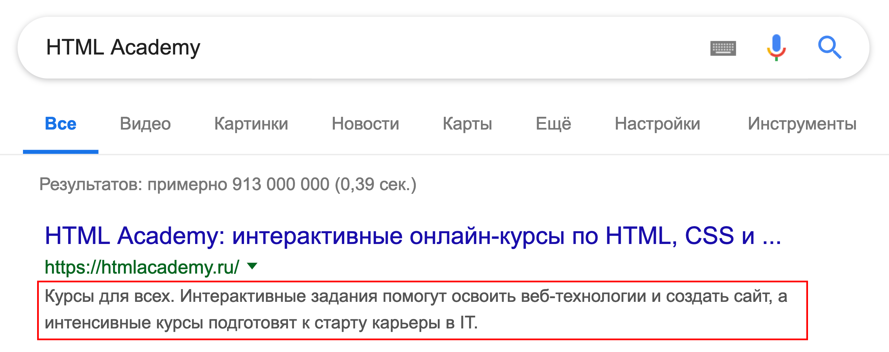

# Тег meta, ключевые слова

С помощью метатегов можно добавить на страницу информацию полезную для поисковых систем: перечень ключевых слов и краткое описание страницы.

Перечень ключевых слов задаётся тегом `<meta>`, у которого атрибут `name` имеет значение `keywords`. Ключевые слова (самые важные слова из содержания страницы) перечисляются в атрибуте `content` через запятую:

```html
<meta name="keywords" content="важные, ключевые, слова">
```

Раньше этот тег был очень важен для поисковиков. Каково положение дел сейчас? Мы бы с удовольствием вам поведали, но это большой секрет Яндекса и Гугла.

Краткое описание страницы задаётся похожим образом, только значение атрибута `name` меняется на `description`:

```html
<meta name="description" content="краткое описание">
```

Краткое описание (или аннотация) страницы часто используется поисковиками при отображении результатов поиска.



> **_BTW:_**
> Существуют рекомендации по правильному использованию метатегов от [Гугла](https://developers.google.com/search/docs/advanced/crawling/special-tags).