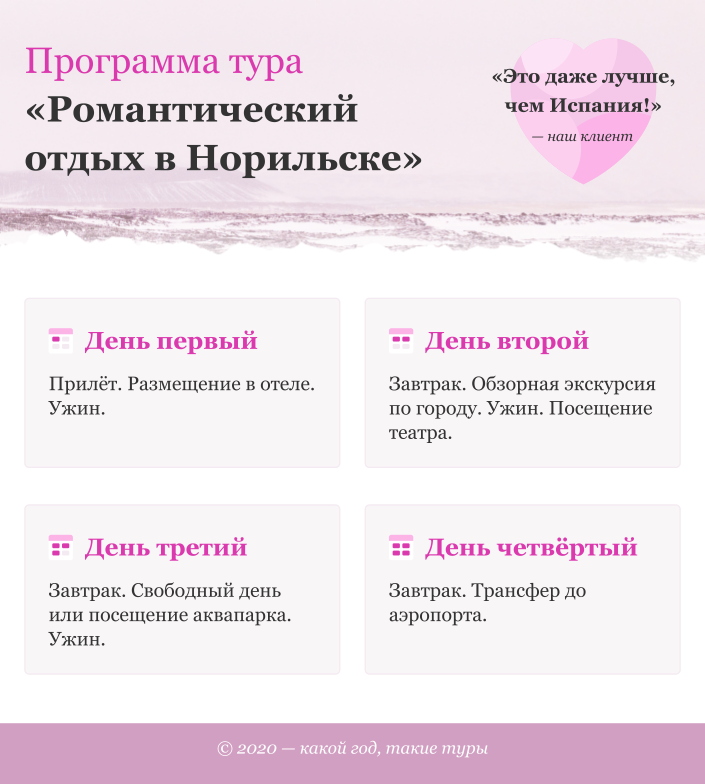
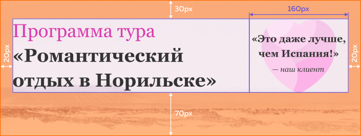
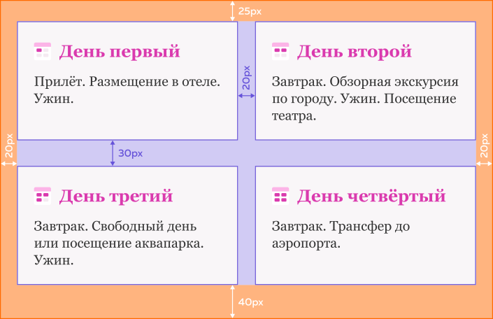
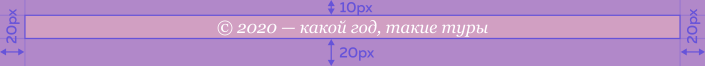

# Испытание: Программа тура

Вам предстоит самостоятельно сверстать сетку страницы:

Разметка и декоративные стили готовы, осталось написать сеточные стили. Советуем сразу **обнулить внешние отступы** у `<body>`, а для создания колонок использовать гриды.

В шапке должно быть две колонки: правая имеет фиксированный размер, а левая занимает всё оставшееся пространство. Не забудьте про внутренние отступы.

Список дней также нужно разделить на две колонки, на этот раз одинаковой ширины. Колонки должны занимать всё доступное пространство. Не забудьте убрать у списка внешние отступы по умолчанию и переопределить внутренние отступы. Обратите особое внимание на отступы между элементами, они разные у рядов и колонок.

Подвал страницы довольно простой, но у него отличается внутренний отступ сверху.

