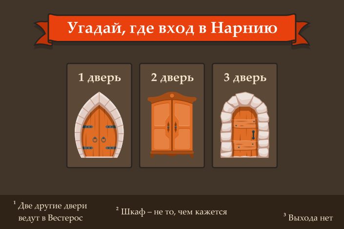
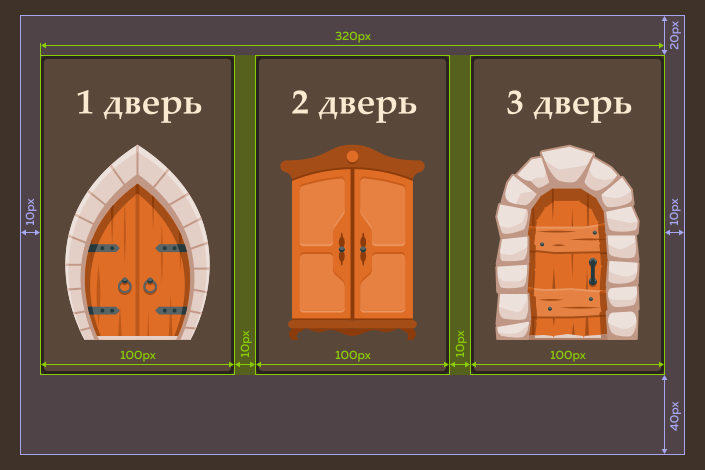
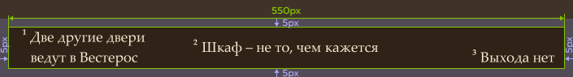
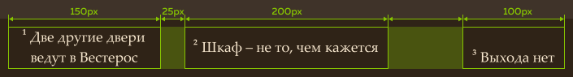

# Испытание: «Волшебная дверь»

Вы доказали, что можете сверстать страницу, используя флексы, и готовы к новому испытанию. На этот раз вам нужно закончить вёрстку страницы-тизера для игры «Волшебная дверь».

Разметку менять не придётся, декоративные стили тоже уже написаны. Дело за малым — сверстать сетку страницы. Для вёрстки этой страницы используйте флексы.

**Не забудьте обнулить** внешние отступы у `<body>` и `<ul>`.

Списку дверей нужно задать фиксированную ширину и выровнять его по центру. Сиреневым цветом на макете обозначены внутренние отступы:

В подвале фон должен тянуться на всю ширину страницы, но содержимое при этом должно иметь фиксированную ширину и располагается по центру. Используйте обёртку — она уже есть в разметке. И не забудьте указать внутренние отступы.

Отступы между колонками в подвале должны быть разного размера. Между первой и второй нужно сделать фиксированный отступ, а третью колонку — прижать к правому краю контейнера. Также обратите внимание, что текст во второй колонке должен быть отцентрован по **вертикали**, а в третьей — прижат к нижней границе.

