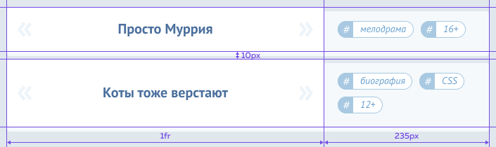
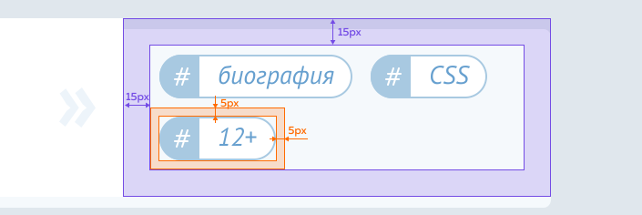

# Испытание: Фильмография

Кекс решил составить каталог фильмов, и без вашей помощи не обойтись.

Вам предстоит сверстать несколько карточек фильмов. Между карточками нужно добавить отступ. Используйте для этого `margin-bottom`.

Содержимое карточек нужно отцентровать по вертикали и разделить на две колонки: в первой — название фильма, во второй — список тегов.

У списка тегов следует убрать внешние отступы по умолчанию и переопределить внутренние. Элементы списка должны быть выстроены горизонтально слева направо. Если они не помещаются на одной строке, то должны переноситься на следующую. Каждому элементу списка нужно добавить свои внешние отступы.

В элементы списка вложены ссылки. Им нужно добавить внутренние отступы. И не забудьте изменить у ссылок тип бокса. Обратите внимание, иконка слева у элемента списка не является частью ссылки.

